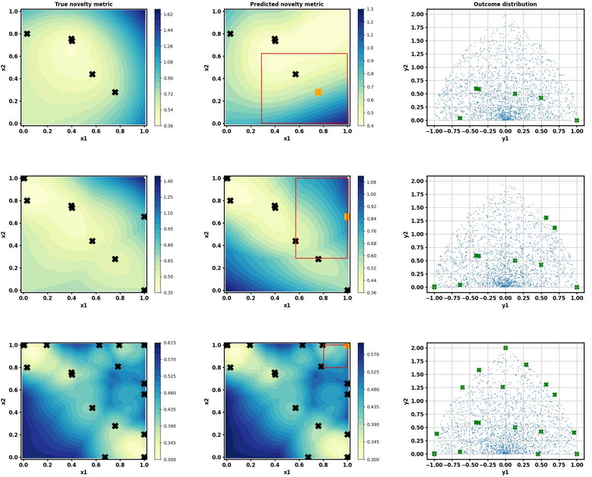

# TR-BEACON: Shedding Light on Efficient Behavior Discovery in High-Dimensional Spaces with Bayesian Novelty Search over Trust Regions
This is the repo containing codes and results for [TR-BEACON: Shedding Light on Efficient Behavior Discovery in High-Dimensional Spaces with Bayesian Novelty Search over Trust Regions](https://openreview.net/pdf?id=9Xo6ONB8E3) paper published at the NeurIPS 2024 Workshop on Bayesian Decision-making and Uncertainty.

TR-BEACON is the extension of the Bayesian optimization inspired novelty search algorithm BEACON. Please refer to the [original BEACON paper](https://arxiv.org/abs/2406.03616) and [github repo](https://github.com/PaulsonLab/BEACON) for more detail.



# Installation
```sh
pip install -r requirements.txt
```

# Usage
We provide the code scripts for executing TR-BEACON, BEACON, and other SOTA novelty search algorithm. Noted that all code script requires the usage of [ThompsonSampling.py](https://github.com/PaulsonLab/BEACON/blob/1ede361eb98824b459da9df3a17839ab8753d02b/ThompsonSampling.py) file to perform efficient Thompson sampling strategy proposed in [this work](https://arxiv.org/abs/2002.09309).

Running Experiments
------------------------------
Run the following commands to execute TR-BEACON on a 20-d Ackley function:
   
```sh
python Continuous_TR_BEACON.py
```
